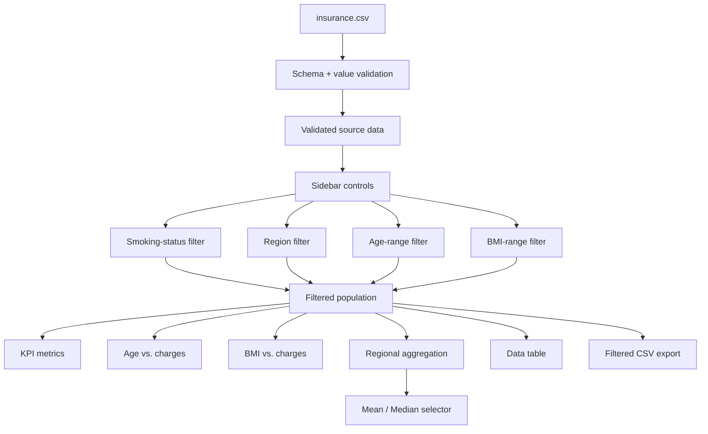

<div align="center">

# 🩺 Medical Insurance Cost Explorer

### What changes when we change the population we are looking at?

**An interactive exploration of medical-charge patterns across age, BMI, smoking status, and U.S. regions**

[](https://medical-insurance-cost-analytics-09.streamlit.app/)
[](app.py)
[](analytics.py)

<br>


**[🚀 Open the dashboard](https://medical-insurance-cost-analytics-09.streamlit.app/) · [💻 View the app](app.py) · [🧭 How to explore](#explore-the-dashboard)**

</div>

---

## The question

Medical-charge data can tell very different stories depending on which population is being examined.

A full-dataset average may hide differences across age groups, BMI ranges, smoking status, or regions. A mean may also tell a different story from a median when the charge distribution is skewed.

This project makes those analytical choices **interactive**.

Instead of presenting a single fixed chart, the dashboard lets users refine the population and immediately see how the summary metrics, scatter plots, regional comparisons, source records, and downloadable data change.

| Project at a glance | |
|:--|:--|
| **Domain** | Medical insurance cost analytics |
| **Source records** | 1,338 |
| **Variables** | 7 |
| **Missing values** | 0 |
| **Exact duplicate rows** | 1 retained |
| **Primary quantitative variables** | Age, BMI, children, charges |
| **Primary categorical variables** | Sex, smoker status, region |
| **Application** | Streamlit |
| **Visualization** | Plotly |
| **Data analysis** | Pandas |
| **Validation / tests** | Pytest |
| **Deployment** | Streamlit Community Cloud |

> **Interpretation note:** the bundled CSV does not independently document currency, collection period, insurer, plan structure, or detailed billing methodology. The application therefore treats `charges` as the numerical charge field supplied by the dataset rather than assuming unsupported financial context.

---

## Explore the dashboard

### **[Launch the live application →](https://medical-insurance-cost-analytics-09.streamlit.app/)**

The dashboard is organized around a simple idea:

**filter the population → observe how the analytical story changes**

Use the left sidebar to control the population displayed throughout the application.

| Control | What it changes | Why it matters |
|:--|:--|:--|
| **Smoking status** | Smoker / non-smoker population | Compare charge patterns across smoking groups |
| **Region** | Selected U.S. regions | Restrict analysis to geographic groups |
| **Age range** | Minimum and maximum age | Explore age-specific populations |
| **BMI range** | Minimum and maximum BMI | Investigate different BMI ranges |
| **Regional metric** | Mean or median | Compare two different summaries of regional charges |

Every sidebar selection updates the same analytical population across:

- KPI metrics
- Age vs. charges chart
- BMI vs. charges chart
- Regional comparison
- Data table
- CSV export

---

<details>
<summary><strong>▶ Quick guided tour</strong></summary>

<br>

### 1 · Start with the complete dataset

Open the dashboard with the default filters.

You should initially see all **1,338 records**.

Review the four top-level metrics:

- Records
- Mean charges
- Median charges
- Smoker share

These provide an immediate summary of the currently selected population.

### 2 · Compare smoking groups

In the sidebar, select only:

**Smoker**

Observe how the following change together:

- Number of records
- Mean charges
- Median charges
- Smoker share
- Scatter-plot distribution
- Regional aggregates

Then switch to:

**Non-smoker**

The purpose is not simply to produce two charts—it is to make the effect of changing the analytical population visible.

### 3 · Explore age

Adjust the **Age** slider.

For example, narrow the range to a smaller age interval.

Watch how the age-versus-charges chart and summary metrics respond.

### 4 · Explore BMI

Use the **BMI** slider to isolate different portions of the observed BMI range.

The BMI-versus-charges scatter plot updates immediately.

### 5 · Compare mean and median

Under **Regional comparison metric**, switch between:

- Mean
- Median

If the two measures differ substantially, that is useful evidence that the distribution may be asymmetric or influenced by high-value observations.

### 6 · Inspect the underlying records

Open:

**Data & export**

The displayed table contains the same records currently represented in the charts.

### 7 · Export your current analytical population

Select:

**Download filtered CSV**

The downloaded file contains only the currently filtered records.

</details>

---

## Dashboard views

The application separates the analytical experience into three main tabs.

### 📈 Visualizations

The main analytical view contains:

1. **Age and charges**
2. **BMI and charges**
3. **Regional charge comparison**

All charts respond to the sidebar filters.

### ▦ Data & export

This view exposes the source-level observations behind the currently displayed charts.

Users can:

- inspect individual records;
- verify selected values;
- review all seven source columns;
- download the filtered population as CSV.

### ⓘ About

The About view provides analytical context, including:

- dataset description;
- source record count;
- missing-value count;
- duplicate-row count;
- data dictionary;
- chart-reading guidance;
- interpretation boundaries.

---

## Analytical views

### 01 · Age and medical charges

The first scatter plot maps:

| Visual channel | Variable |
|:--|:--|
| **X position** | Age |
| **Y position** | Charges |
| **Color** | Smoking status |
| **Hover detail** | BMI, region, children |

Each point represents one record from the filtered dataset.

This view is designed for exploring how observed medical charges vary across age while retaining smoking status as a categorical grouping variable.

---

<details>
<summary><strong>▶ How to read the age-versus-charges chart</strong></summary>

- Moving **left to right** represents increasing age.
- Moving **bottom to top** represents increasing charges.
- Color separates smoker and non-smoker observations.
- Hovering over a point reveals supporting attributes.
- Changing sidebar filters changes the records included in the plot rather than merely hiding visual elements.

The plot describes patterns in the available sample. It does not establish that age or smoking status causes a particular medical charge.

</details>

---

### 02 · BMI and medical charges

The second scatter plot maps:

| Visual channel | Variable |
|:--|:--|
| **X position** | BMI |
| **Y position** | Charges |
| **Color** | Smoking status |
| **Hover detail** | Age, region, children |

The visualization makes it possible to inspect the relationship between BMI and charges while comparing the two smoking-status categories.

The charge axis uses the same general visual treatment as the age scatter plot so the two views can be interpreted consistently.

---

<details>
<summary><strong>▶ Why use position for the main variables?</strong></summary>

Age, BMI, and charges are quantitative variables.

The dashboard therefore places the most important quantitative comparisons on horizontal and vertical position rather than relying on area, shape, or other less precise visual channels.

Color is reserved primarily for distinguishing categorical smoking groups.

This separation helps the chart communicate both:

- quantitative relationships;
- categorical grouping.

</details>

---

### 03 · Regional comparison

The regional bar chart summarizes the currently selected records by U.S. region.

Users can switch between:

**Mean charges**

and

**Median charges**

The regional aggregation is recalculated from the filtered population rather than from the original unfiltered dataset.

| Metric | Interpretation |
|:--|:--|
| **Mean** | Arithmetic average of selected charge values |
| **Median** | Middle selected charge value |
| **Record count** | Number of observations contributing to the regional result |

The bar chart starts from zero because bar length is being used to encode magnitude.

---

<details>
<summary><strong>▶ Why compare mean and median?</strong></summary>

Mean and median answer related but different questions.

The **mean** incorporates the magnitude of every observation and can therefore be strongly affected by large values.

The **median** identifies the middle of the ordered distribution and is less sensitive to extreme observations.

When the two differ substantially, that difference itself is analytically informative.

Neither statistic is automatically “better.” They describe different characteristics of the selected distribution.

</details>

---

## Interactive filtering model

The dashboard uses one shared filtered population for every analytical component.



The dashboard does not maintain separate hidden datasets for individual charts.

The same filtered records drive the metrics, visualizations, table, and export.

---

## Key features

### Interactive population filtering

Refine observations by:

- age;
- BMI;
- smoking status;
- U.S. region.

### Dynamic KPI layer

Every interaction recalculates:

- record count;
- mean charges;
- median charges;
- smoker share.

### Coordinated analytical views

The same population is used across all charts and data views.

### Mean / median comparison

Users can change the statistical summary used in regional comparisons.

### Interactive Plotly charts

Hover behavior exposes supporting details without overcrowding the primary visual encodings.

### Filtered data export

Users can download exactly the observations represented by the current dashboard state.

### Data-quality transparency

The application reports rather than silently hides source-data characteristics.

### Cached data loading

The validated dataset is cached using Streamlit to keep ordinary widget interactions responsive.

### Dark analytical interface

A custom charcoal theme provides high visual contrast with restrained teal and amber accents.

---

## Data

The project uses:

```text
data/insurance.csv
```

The supplied file contains **1,338 rows and 7 columns**.

| Column | Type | Interpretation |
|:--|:--|:--|
| `age` | Integer | Age in years |
| `sex` | Category | Recorded sex category |
| `bmi` | Numeric | Body mass index |
| `children` | Integer | Recorded number of covered children / dependents |
| `smoker` | Category | Smoking status |
| `region` | Category | Recorded U.S. region |
| `charges` | Numeric | Medical-cost charge field supplied in the dataset |

### Data-quality profile

| Check | Result |
|:--|--:|
| Records | **1,338** |
| Columns | **7** |
| Missing cells | **0** |
| Exact duplicate rows | **1** |
| Minimum age | **18** |
| Maximum age | **64** |

The duplicate observation is intentionally retained.

The application reports its presence rather than silently altering the original sample.

---

<details>
<summary><strong>▶ Why is the duplicate row retained?</strong></summary>

Removing a duplicate is an analytical decision, not merely a formatting operation.

The bundled CSV does not provide a unique person identifier or supporting metadata that proves the repeated row represents an accidental duplicate rather than two observations with identical values.

For that reason, the application preserves the supplied source records and reports the exact-duplicate count transparently.

</details>

---

## Data validation

Before any chart is created, [`analytics.py`](analytics.py) validates the dataset.

The validation layer checks:

- required columns;
- numerical conversion;
- missing values;
- non-negative ages;
- positive BMI values;
- non-negative charge values;
- non-negative children counts;
- recognized smoker categories.

If a required condition fails, the application raises an explicit data-quality error rather than continuing with an invalid analytical table.

---

## Caching and responsiveness

Streamlit reruns the application script when a user interacts with widgets.

Reloading and validating the same data on every interaction would be unnecessary.

The application therefore caches the loading step:

```python
@st.cache_data(show_spinner="Preparing insurance data…")
def load_data(file_path: str, file_mtime_ns: int) -> pd.DataFrame:
    ...
```

The source file's modification timestamp participates in the cache key.

This means:

- ordinary widget interactions reuse the cached dataset;
- a modified source file can invalidate the cached load.

Filtering remains dynamic while the underlying validated source data is reused efficiently.

---

## Visual design

The dashboard uses a custom dark analytical interface.

| Role | Color |
|:--|:--|
| **Primary background** | `#111318` |
| **Panel background** | `#1b2028` |
| **Primary text** | `#e9eff4` |
| **Muted text** | `#abb6c4` |
| **Primary accent** | `#6cdec9` |
| **Secondary accent** | `#f5b76b` |

The Streamlit theme is defined in:

[`/.streamlit/config.toml`](.streamlit/config.toml)

```toml
[theme]
base = "dark"
primaryColor = "#6cdec9"
backgroundColor = "#111318"
secondaryBackgroundColor = "#1b2028"
textColor = "#e9eff4"
font = "sans serif"
```

---

<details>
<summary><strong>▶ Explore the repository structure</strong></summary>

```text
medical-insurance-cost-analytics/
├── app.py
├── analytics.py
├── requirements.txt
├── README.md
├── .gitignore
│
├── .streamlit/
│   └── config.toml
│
├── data/
│   └── insurance.csv
│
└── tests/
    └── test_analytics.py
```

### `app.py`

Main Streamlit application:

- page configuration;
- custom styling;
- cached data loading;
- sidebar controls;
- KPI metrics;
- Plotly visualizations;
- tabs;
- data export;
- About content.

### `analytics.py`

Reusable analytical logic:

- schema validation;
- data normalization;
- filtering;
- regional aggregation.

### `tests/test_analytics.py`

Reproducible checks for:

- source dimensions;
- missing values;
- duplicate count;
- age boundaries;
- filter behavior;
- empty selections;
- regional aggregation;
- invalid schemas;
- invalid aggregation requests.

</details>

---

## Testing

The project includes automated tests for the analytical layer.

Run:

```bash
python3 -m pip install pytest
python3 -m pytest -q
```

The test suite validates both source-data assumptions and the functions used by the interactive dashboard.

---

<details>
<summary><strong>▶ What the automated tests verify</strong></summary>

The test suite checks that:

1. the bundled source contains **1,338 rows and 7 columns**;
2. there are no missing values;
3. the original duplicate observation remains present;
4. age ranges remain within the expected source boundaries;
5. the unfiltered view preserves all observations;
6. simultaneous filters correctly constrain every selected dimension;
7. choosing no group returns an empty analytical population;
8. regional aggregation agrees with the equivalent Pandas calculation;
9. an invalid dataset schema raises an error;
10. unsupported regional statistics are rejected.

</details>

---

## Reproduce locally

Clone the repository:

```bash
git clone https://github.com/nazishatta/medical-insurance-cost-analytics.git
cd medical-insurance-cost-analytics
```

Create a virtual environment:

```bash
python3 -m venv .venv
```

Activate it on macOS / Linux:

```bash
source .venv/bin/activate
```

Windows PowerShell:

```powershell
.venv\Scripts\Activate.ps1
```

Install the project dependencies:

```bash
python3 -m pip install -r requirements.txt
```

Run the dashboard:

```bash
python3 -m streamlit run app.py
```

Then open:

```text
http://localhost:8501
```

The application loads the bundled CSV using a project-relative path, so no external API credentials or database connection are required.

---

<details>
<summary><strong>▶ Deployment configuration</strong></summary>

The public application is hosted on **Streamlit Community Cloud**.

**Live application**

https://medical-insurance-cost-analytics-09.streamlit.app/

**GitHub repository**

https://github.com/nazishatta/medical-insurance-cost-analytics

Deployment configuration:

| Setting | Value |
|:--|:--|
| Repository | `nazishatta/medical-insurance-cost-analytics` |
| Branch | `main` |
| Entry point | `app.py` |
| Dependencies | `requirements.txt` |
| Theme | `.streamlit/config.toml` |
| Data | `data/insurance.csv` |

Changes pushed to the deployed branch can be reflected by the Streamlit Community Cloud deployment.

</details>

---

## Visualization integrity & interpretation

This dashboard is designed for **exploratory descriptive analysis**.

Several safeguards are intentionally built into the presentation:

- Quantitative relationships use position as the primary visual channel.
- Smoking status uses categorical color rather than an ordered scale.
- Regional bar charts begin at zero.
- Mean and median are explicitly distinguished.
- All filters update the same analytical population.
- Source-level records remain available for inspection.
- The application does not silently remove the duplicate row.
- Charge values are not automatically labeled with a currency the source file does not document.
- Associations are not described as causal effects.

> **Association ≠ causation.** A visible relationship between smoking status, BMI, age, region, and charges does not by itself demonstrate that one variable causes another.

---

## Dataset limitations

The bundled CSV alone does not establish:

- collection date;
- collection methodology;
- sampling design;
- population representativeness;
- insurance carrier;
- policy type;
- plan design;
- currency;
- detailed billing methodology;
- medical diagnoses;
- treatment history.

Therefore, the application should be interpreted as an exploratory analysis of the **1,338 supplied observations**, not as a representation of current insurance prices or an estimate for an individual patient.

---

## Technology stack

| Technology | Role |
|:--|:--|
| **Python** | Application and analytical logic |
| **Pandas** | Data validation, filtering and aggregation |
| **Plotly** | Interactive analytical visualizations |
| **Streamlit** | Interactive dashboard interface |
| **Pytest** | Reproducible analytics testing |
| **Git / GitHub** | Version control and source hosting |
| **Streamlit Community Cloud** | Public application deployment |

---

## Potential extensions

Future development could extend the project with:

- charge-distribution views;
- box or violin plots;
- correlation analysis;
- subgroup comparison panels;
- additional accessibility controls;
- feature-engineering experiments;
- predictive modeling;
- model-performance visualization;
- SHAP-based explanation;
- confidence intervals;
- automated CI testing;
- external data-source integration.

These would be treated as extensions rather than silently mixed into the current descriptive analysis.

---

## Author

**Nazish Atta**

Data Science · Analytics · Interactive Visualization

- [GitHub Profile](https://github.com/nazishatta)
- [Project Repository](https://github.com/nazishatta/medical-insurance-cost-analytics)
- [Live Dashboard](https://medical-insurance-cost-analytics-09.streamlit.app/)

---

<div align="center">

### Explore the population. Change the filters. Watch the analytical story change.

[](https://medical-insurance-cost-analytics-09.streamlit.app/)

<br>

**Python · Pandas · Plotly · Streamlit**

</div>
